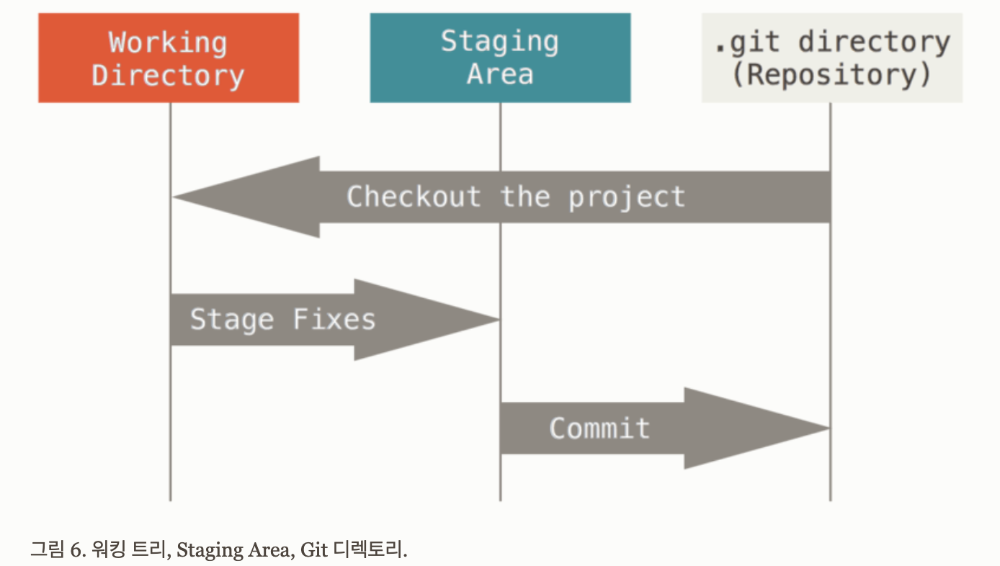
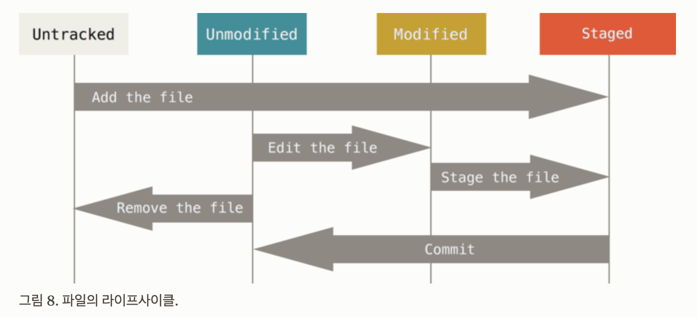

### **배경**

초기 Linux kernel 프로젝트는 패치파일을 갖고 업데이트하며 관리되어왔다. 점점 거대해지는 프로젝트를 패치파일로 관리하기에는 힘들었던 것 같고 BitKeeper[^footnote]라는 소스 관리 시스템을 도입해 사용한것으로 보여진다. BitKeeper로 Linux kernel 프로젝트를 관리하는데 일련의 문제[^fn-nth-2][^fn-nth-3]가 있었고, Linux kernel 프로젝트에서 BitKeeper를 사용하지 못하게되어 개발된것이 Git이었다. 

### **목표**

> - 빠른 속도  
> - 단순한 구조  
> - 비선형적인 개발  
> - 완벽한 분산  
> - Linux Kernel 같은 대형 프로젝트에 유용

### **버전 관리**
Git의 배경과 목표를 간단히 살펴봤으니, 버전 관리 시스템에 대한 정보를 살펴보자.
버전 관리 시스템(Version Control System)은 파일 변화를 시간에 따라 기록했다가 나중에 특정 시점의 버전을 다시 불러올 수 있는 시스템이다. 시간에 따라 수정 내용을 비교해 볼 수 있고, 문제가 발생했을 때 추적도 가능하며, 누가 언제 만들어낸 이슈인지도 알 수 있다. VCS를 사용하면 파일에 문제가 발생하더라도 쉽게 대처가 가능하다.   

1. **로컬 버전 관리**  
- 버전 관리 시스템의 초기 개념으로 개별 파일에 대한 버전 관리가 목적이었다. 
- 리비전 컨트롤 시스템(Revision Control System, RCS)[^fn-nth-4][^fn-nth-5]은 로컬 버전 관리의 초기 구현체다.

1. **중앙집중식 버전 관리**  
- 로컬 버전 관리와 비교해서 개별 파일이 아닌 프로젝트 단위의 버전 관리가 가능하다.
- 서버와 클라이언트 구조로 서버에 프로젝트의 현재 버전과 변화를 저장하고 클라이언트들이 서버에 접속해서 프로젝트의 복사본을 얻을 수 있다. 작업한 뒤에, 바뀐 내용을 서버에 업데이트 한다.
- 동시 버전 시스템(Concurrent Versions System, CVS)[^fn-nth-6]은 중압집중식 버전 관리의 구현체다.
1. **분산 버전 관리**  
- 버전 관리 저장소와 히스토리를 전부를 복제, 서버(원격저장소)에 문제가 발생해도 작업할 수 있다.
- Git[^fn-nth-7]은 분산 버전 관리의 구현체다.
- **Git은 로컬 버전 관리, 중앙집중식 버전 관리의 문제점들을 보완하는 형태의 분산 버전 관리의 특징을 지니고 있다.**

### **Git 데이터 저장소와 기초**
Git은 기존 버전 관리 시스템의 델타 방식이 아닌 스냅샷 방식으로 데이터를 관리한다. 스냅샷이 무엇인지, Git이 데이터를 어떻게 다루는지 간단히 살펴보자.

#### **스냅샷과 Key-Value 데이터 저장소**

- 스냅샷(snapshot)은 현재 시각의 파일의 상태를 저장하는 기술이다. 델타 기술은 변경된 부분만을 저장하는 방식의 기술이다.
- Git은 각 커밋마다 프로젝트 디렉토리의 전체 파일 트리를 스냅샷으로 저장. 변경된 파일의 상태만 새로운 객체로 저장하고, 변경되지 않은 파일들은 새롭게 저장하지 않고 이전 상태의 파일에 대한 링크만을 저장하여 저장 공간을 절약한다.
- Git의 Key-Value 데이터 저장소
	1. Key: SHA-1 해시
		- 파일의 내용을 해시 함수를 통해서 고유한 해시 값을 생성. 이 해시 값은 블롭 객체의 Key로 사용한다.
		- 모든 조건[^fn-nth-8]이 같다면 동일한 Key값이 생성될 수 있음. 하지만 모든 조건이 같기는 매우 어렵고, SHA-1 연산 결과 같은 값이 나올 확률 또한 매우 낮다.
	1. Value: 블롭 객체
		- 블롭 객체는 파일의 내용을 저장. 이 블롭 객체는 변경되지 않으며, 파일의 내용이 변경되면 새로운 블롭 객체가 생성한다.
		- Git은 블롭 객체를 통해 파일의 상태를 추적한다.

#### **파일 상태 단계**
Git이 파일을 어떻게 관리하는지 살펴보자.

1. **Working Directory**
- `git status` 로 `Working Directory`에 파일들의 상태를 확인한다.
- `Working Directory`에서 파일 상태는 `Tracked(Unmodified)` 와 `Untracked`, `Modified` 로 구분된다.
- `Untracked` 인 파일이 commit이 되어 `.git directory(Repository)`에 저장되면 `Tracked(Unmodified)` 된다.
- `Tracked(Unmodified)` 된 파일의 내용이 변경되면 `Modified` 상태가 된다.

1. **Staging Area**
- `git status` 로 `Staging Area`에 파일들을 확인할 수 있다.
- `Repository` 에 저장(반영)되기 전 단계이다.
- `git add`를 통해서 `Modified`와 `Untracked`파일을 `Staged`상태로 만든다.
- `git reset`을 통해서 `Staged` 상태에서 되돌린다.

1. **.git directory(Repository)**
- commit_id(Key) - 블롭_객체(Value) 형태로 저장된다. (트랜잭션이 저장소에 반영됨)
- `git commit`을 통해서 `Unmodified` 상태로 만든다.
- `git log`를 통해서 commit한 정보를 확인할 수 있다.
- `git checkout`을 통해서 브랜치 또는 특정 commit_id의 `Working Directory`로 추적가능하다.

다음은 프로젝트에 Git을 도입하고 설정하는 과정을 살펴보자.

[^footnote]: [https://www.bitkeeper.org](https://www.bitkeeper.org)
[^fn-nth-2]: [How Tridge reverse engineered BitKeeper](https://lwn.net/Articles/132938/)
[^fn-nth-3]: [Tridgell drops BitKeeper bombshell](https://www.theregister.com/2005/04/22/tridgell_releases_sourcepuller/)
[^fn-nth-4]: [GNU RCS; https://www.gnu.org/software/rcs/](https://www.gnu.org/software/rcs/)
[^fn-nth-5]: [Revision Control System(wiki)](https://en.wikipedia.org/wiki/Revision_Control_System)
[^fn-nth-6]: [CVS](https://www.nongnu.org/cvs/), [https://ko.wikipedia.org/wiki/CVS](https://ko.wikipedia.org/wiki/CVS)
[^fn-nth-7]: [Git; https://git-scm.com/](https://git-scm.com/)
[^fn-nth-8]: [How is git commit sha1 formed](https://gist.github.com/masak/2415865)
